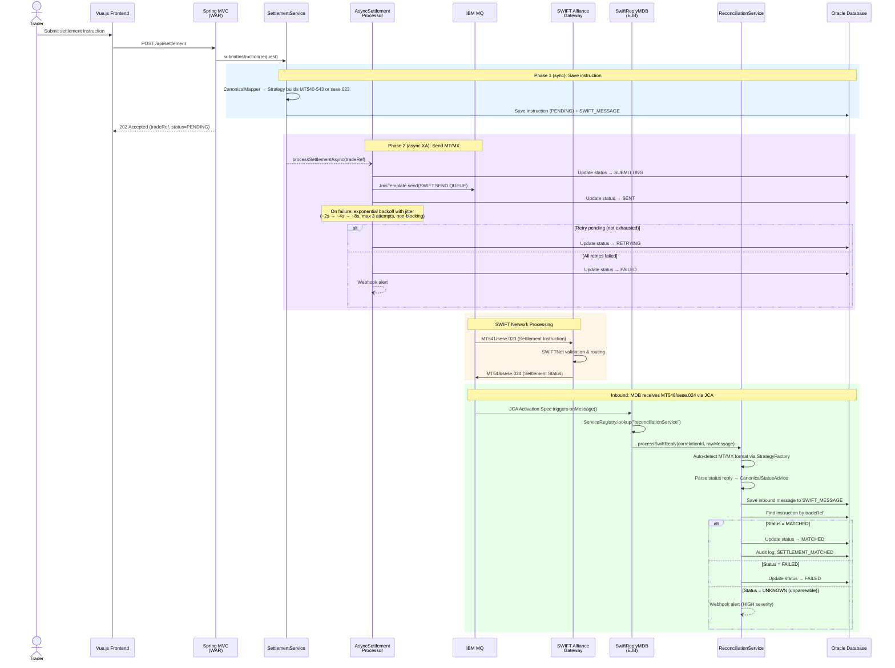
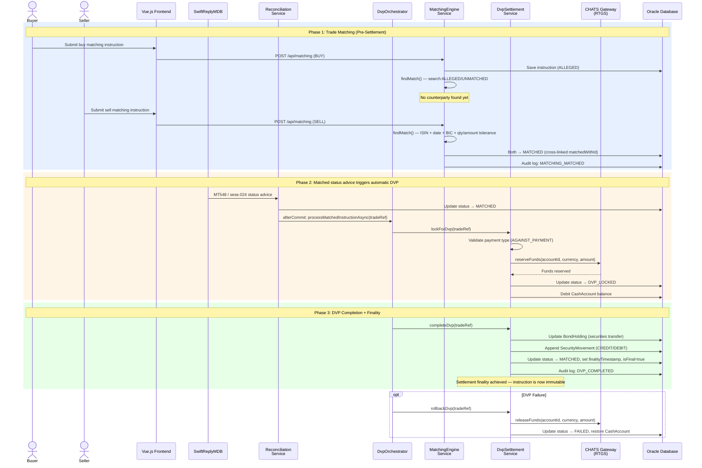
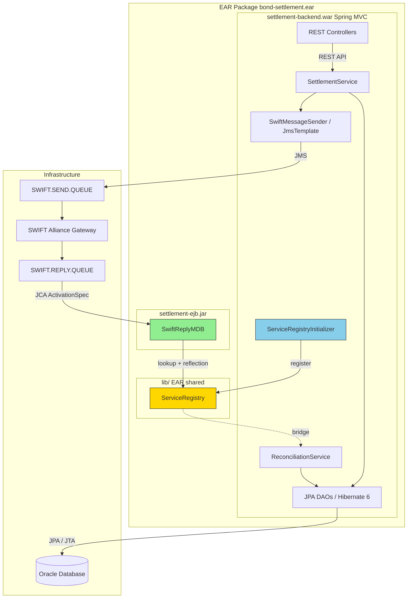
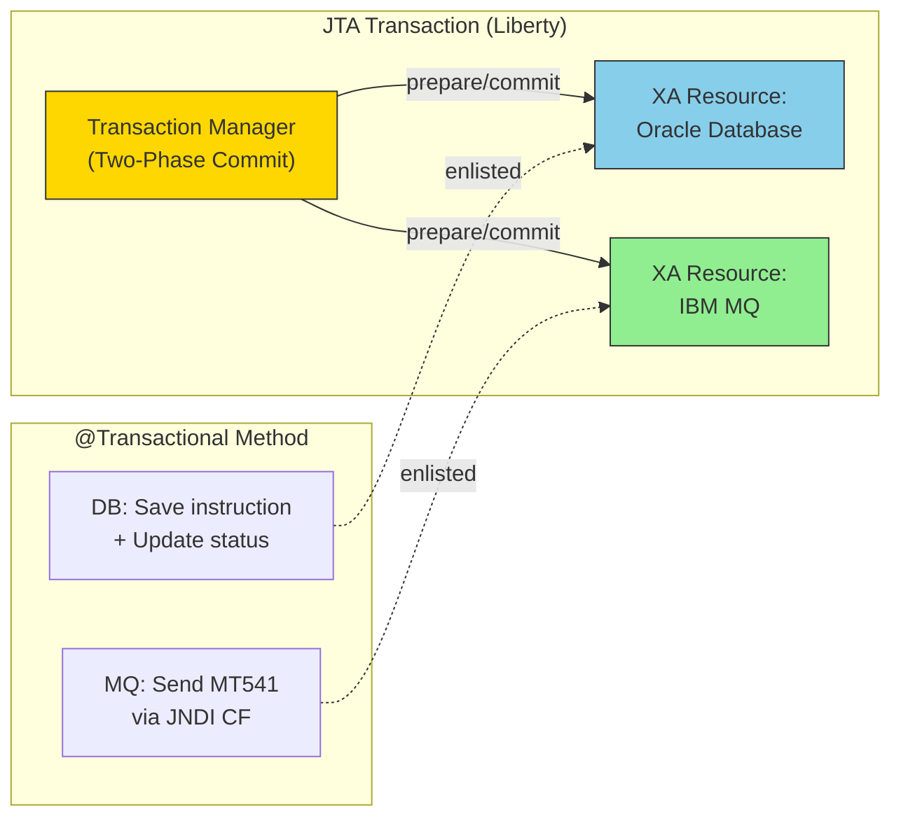

# Bond Settlement System

A SWIFT bond settlement workflow system built for IBM WebSphere + Oracle environment.

## Architecture

- **Frontend**: Vue.js 3 + Vite + Axios — Pre-Settlement (Trade Matching) / Settlement (SWIFT Direct, Monitor) / Reference (Holdings, Counterparties)
- **Backend**: Spring MVC 6 REST API
- **Settlement Engine**:
  - **DVP (Delivery vs Payment)**: BIS Model 1 real-time DVP with CHATS RTGS abstraction — simultaneous securities and cash settlement (PFMI Principle 12)
  - **Matching Engine**: Bilateral instruction matching — buy/sell counterparties submit independently; engine auto-matches on ISIN + date + direction + BIC + quantity/amount tolerance
  - **Settlement Finality**: PFMI Principle 8 — `finalityTimestamp` and immutability flag prevent post-settlement modification
  - **Multi-currency**: HKD / USD / EUR / CNY support throughout the data model
- **SWIFT Messaging**: Dual-standard support (MT and MX) with explicit MT↔MX translation endpoints
  - **MT (FIN)**: Prowide Core — MT540-543 (send) / MT548 (receive)
  - **MX (ISO 20022)**: Prowide ISO 20022 — sese.023/025/026 (send) / sese.024 (receive)
  - **MT↔MX Translation**: On-demand translation API using the canonical data model
  - **Strategy Pattern**: `SwiftMessageStrategy` interface with `MtStrategy` / `MxStrategy` implementations
  - **Canonical Data Model**: Format-independent `CanonicalSettlement` / `CanonicalStatusAdvice` decouples business logic from message formats
  - **Counterparty Routing**: `COUNTERPARTY_CAPABILITY` registry drives send-format selection (MT_ONLY / MX_ONLY / DUAL)
  - **Message Type Coverage**: MT540 (RFP), MT541 (RAP), MT542 (DFP), MT543 (DAP), MT548 (Status), MT535 (Holdings), MT536 (Transactions), MT564/566 (Corporate Actions), sese.023/024/025/026, sese.002/017, seev.031/036
- **Message Queue**: IBM MQ via JMS
  - **Sending**: Spring JmsTemplate with application-managed MQ client connection
  - **Receiving**: Message-Driven EJB (MDB) via JCA activation spec on IBM MQ Resource Adapter
- **Persistence**: Hibernate 6 / JPA 3.1 on Oracle Database
- **Application Server**: IBM WebSphere Liberty (Jakarta EE 10)
- **Packaging**: EAR (WAR + EJB JAR + Common Library)

## Prerequisites

- JDK 21
- Maven 3.9+
- Node.js 24+ (for frontend)
- Docker & Docker Compose (for local development)

### Runtime Stack (provided via Docker)

- IBM WebSphere Liberty 24.x (Jakarta EE 10)
- IBM MQ 9.3+ (Jakarta-compatible Resource Adapter)
- Oracle Database 19c+ (XE edition for dev)

## Settlement Flows

### Flow 1: SWIFT Direct Settlement (Cross-CSD)



### Flow 2: Bilateral Matching + DVP Settlement (Internal CSD)



### Component Architecture



## Quick Start (Docker)

### 1. Prepare dependencies

Download the following and place in `docker/liberty/`:

```bash
# Oracle JDBC driver (from Maven Central or Oracle)
mkdir -p docker/liberty/jdbc
cp ~/.m2/repository/com/oracle/database/jdbc/ojdbc11/23.3.0.23.09/ojdbc11-23.3.0.23.09.jar \
   docker/liberty/jdbc/ojdbc11.jar
```

### 2. Build

```bash
mvn clean package -DskipTests
```

### 3. Start Docker environment

```bash
docker compose up -d
```

This starts:
- **Oracle XE** on port `1521`
- **IBM MQ** on port `1414` (web console on `9443`)
- **WebSphere Liberty** on port `9080` (HTTPS on `9444`)

The Liberty image is built from `docker/liberty/Dockerfile`, which extracts the IBM MQ Jakarta Resource Adapter (`wmq.jakarta.jmsra.rar`) from the MQ container image via multi-stage build.

### 4. Initialize database

Wait for Oracle to be healthy, then run the DDL:

```bash
docker exec -i settlement-oracle bash -c \
  "sqlplus settlement/settlement123@//localhost:1521/XEPDB1" < db/schema.sql
```

> **Note:** When using Docker Compose, the `db/` directory is mounted to `/docker-entrypoint-initdb.d` so the schema is automatically applied on first container startup.

### 5. Verify deployment

```bash
# Check MQ connectivity
curl http://localhost:9080/settlement/api/mq/health

# Submit a DVP settlement instruction (BUY, HKD)
curl -X POST http://localhost:9080/settlement/api/settlement \
  -H "Content-Type: application/json" \
  -d '{
    "isin": "HK0000163607",
    "quantity": 100000,
    "direction": "BUY",
    "counterparty": "HSBC HK",
    "bicCode": "HSBCHKHKXXX",
    "accountId": "ACC-001",
    "settlementDate": "2026-06-01",
    "currency": "HKD",
    "settlementAmount": 980000.00,
    "paymentType": "AGAINST_PAYMENT"
  }'

# Submit matching instructions (bilateral)
curl -X POST http://localhost:9080/settlement/api/matching \
  -H "Content-Type: application/json" \
  -d '{"tradeRef":"M-BUY-001","isin":"HK0000163607","settlementDate":"2026-06-01","quantity":100000,"amount":98000,"currency":"HKD","submitterBic":"HSBCHKHKXXX","counterpartyBic":"BABORHKHXXX","direction":"BUY"}'

curl -X POST http://localhost:9080/settlement/api/matching \
  -H "Content-Type: application/json" \
  -d '{"tradeRef":"M-SELL-001","isin":"HK0000163607","settlementDate":"2026-06-01","quantity":100000,"amount":98000,"currency":"HKD","submitterBic":"BABORHKHXXX","counterpartyBic":"HSBCHKHKXXX","direction":"SELL"}'
# Both should auto-match (status=MATCHED)

# Check holdings
curl http://localhost:9080/settlement/api/holdings
```

Current REST paths:
- Settlement list endpoint is `GET /settlement/api/settlement`
- MQ health endpoint is `GET /settlement/api/mq/health`

### 6. Build frontend (optional)

```bash
cd settlement-frontend
npm install
npm run dev    # Development server on http://localhost:5173
npm run dev:mock # Frontend-only mode with in-memory API mocks
npm run build  # Production build
```

#### Frontend mock mode

For UI development without Liberty, Oracle, or MQ, run:

```bash
cd settlement-frontend
npm run dev:mock
```

Mock mode is enabled by `settlement-frontend/.env.mock` (`VITE_USE_MOCK=true`). The frontend still calls the same `/api` functions, but Axios intercepts requests in-browser and serves in-memory fixtures for settlements, SWIFT messages, holdings, counterparties, and matching. Use regular `npm run dev` when you want the Vite proxy to call the real backend at `http://localhost:9080/settlement`.

## Common Commands

| Command | Description |
|---------|-------------|
| `mvn clean package` | Build all modules (produces EAR) |
| `mvn clean package -DskipTests` | Build without running tests |
| `mvn test` | Run unit tests |
| `mvn verify` | Run unit + integration tests |
| `docker compose up -d` | Start all services |
| `docker compose down` | Stop all services |
| `docker compose up -d --force-recreate liberty` | Redeploy after rebuild |
| `docker compose logs -f liberty` | Follow Liberty logs |
| `docker compose logs -f ibmmq` | Follow MQ logs |

## MQ Administration

```bash
# Enter MQ container
docker exec -it settlement-mq bash

# Check queue depths
echo "DISPLAY QLOCAL(*) CURDEPTH" | runmqsc SETTLEMENT_QM

# Put a test message on reply queue
echo "test message body" | /opt/mqm/samp/bin/amqsput SWIFT.REPLY.QUEUE SETTLEMENT_QM

# Browse messages (non-destructive)
/opt/mqm/samp/bin/amqsbcg SWIFT.SEND.QUEUE SETTLEMENT_QM
```

## Database Administration

```bash
# Connect to Oracle
docker exec -it settlement-oracle sqlplus settlement/settlement123@//localhost:1521/XEPDB1

# Useful queries
SELECT TRADE_REF, STATUS, REQUESTED_STANDARD, RESOLVED_STANDARD, ISIN
FROM SETTLEMENT_INSTRUCTION ORDER BY CREATED_AT DESC;
SELECT * FROM BOND_HOLDING;
SELECT TRADE_REF, EVENT_TYPE, DETAIL FROM AUDIT_LOG ORDER BY CREATED_AT DESC;

-- SWIFT messages (both MT and MX, with translation flag)
SELECT TRADE_REF, MESSAGE_STANDARD, MESSAGE_TYPE, DIRECTION, IS_TRANSLATED, PARSED_STATUS
FROM SWIFT_MESSAGE ORDER BY CREATED_AT DESC FETCH FIRST 20 ROWS ONLY;

-- Counterparty capability registry
SELECT BIC_CODE, PARTICIPANT_NAME, SUPPORTED_STANDARD, PREFERRED_STANDARD, IS_ACTIVE
FROM COUNTERPARTY_CAPABILITY ORDER BY BIC_CODE;

-- Message type registry
SELECT MESSAGE_TYPE, MESSAGE_STANDARD, DESCRIPTION, CATEGORY FROM MESSAGE_TYPE_REGISTRY;

-- Position journal: recent movements
SELECT ACCOUNT_ID, ISIN, MOVEMENT_TYPE, QUANTITY, BALANCE_AFTER, TRADE_REF, CREATED_AT
FROM SECURITY_MOVEMENT ORDER BY CREATED_AT DESC FETCH FIRST 20 ROWS ONLY;

-- EOD snapshots (reconciliation baseline)
SELECT BUSINESS_DATE, ACCOUNT_ID, ISIN, BALANCE FROM EOD_POSITION_SNAPSHOT
ORDER BY BUSINESS_DATE DESC, ACCOUNT_ID, ISIN FETCH FIRST 20 ROWS ONLY;

-- Reconciliation: verify position == EOD snapshot + today's movements
SELECT h.ACCOUNT_ID, h.ISIN,
       h.QUANTITY AS POSITION,
       NVL(e.BALANCE, 0) AS EOD_BALANCE,
       NVL(SUM(CASE WHEN m.MOVEMENT_TYPE = 'CREDIT' THEN m.QUANTITY ELSE -m.QUANTITY END), 0) AS NET_MOVEMENT,
       NVL(e.BALANCE, 0) + NVL(SUM(CASE WHEN m.MOVEMENT_TYPE = 'CREDIT' THEN m.QUANTITY ELSE -m.QUANTITY END), 0) AS EXPECTED
FROM BOND_HOLDING h
LEFT JOIN EOD_POSITION_SNAPSHOT e
  ON h.ACCOUNT_ID = e.ACCOUNT_ID AND h.ISIN = e.ISIN
  AND e.BUSINESS_DATE = (SELECT MAX(BUSINESS_DATE) FROM EOD_POSITION_SNAPSHOT)
LEFT JOIN SECURITY_MOVEMENT m
  ON h.ACCOUNT_ID = m.ACCOUNT_ID AND h.ISIN = m.ISIN
  AND m.CREATED_AT > (SELECT MAX(BUSINESS_DATE) + 1 FROM EOD_POSITION_SNAPSHOT)
GROUP BY h.ACCOUNT_ID, h.ISIN, h.QUANTITY, e.BALANCE;
```

## Modules

| Module | Description |
|--------|-------------|
| `settlement-common` | Shared library: ServiceRegistry bridge + Canonical Data Model (`CanonicalSettlement`, `CanonicalStatusAdvice`, etc.) |
| `settlement-backend` | Spring MVC WAR with REST API, MT/MX strategy pattern, JMS sender, reconciliation |
| `settlement-ejb` | Message-Driven EJB for SWIFT reply processing (MT548 / sese.024) |
| `settlement-ear` | Enterprise Archive packaging for WebSphere deployment |
| `settlement-frontend` | Vue.js 3 single-page application |

## Project Structure

```
my-bond-settlement-system/
├── pom.xml                          # Parent POM (dependency management)
├── docker-compose.yml               # Local dev environment
├── db/
│   └── schema.sql                   # Oracle DDL (all tables + constraints + indexes)
├── docker/
│   ├── liberty/
│   │   ├── server.xml               # Liberty config (MQ RA, JMS, activation spec)
│   │   ├── Dockerfile               # Liberty image with MQ Jakarta RA
│   │   └── jdbc/                    # JDBC driver (gitignored)
│   └── mq/
│       └── config.mqsc              # MQ queue definitions
├── settlement-common/               # Shared library
│   └── src/main/java/com/settlement/
│       ├── bridge/                          # ServiceRegistry cross-module bridge
│       └── canonical/                       # Canonical Data Model (format-independent)
│           ├── CanonicalSettlement.java      # Settlement instruction model
│           ├── CanonicalStatusAdvice.java    # Status reply model
│           ├── PartyInfo.java               # Party information (BIC, LEI, account)
│           ├── SettlementDirection.java      # RECEIVE / DELIVER
│           └── PaymentType.java             # AGAINST_PAYMENT / FREE_OF_PAYMENT
├── settlement-backend/              # Spring MVC WAR module
│   └── src/main/java/com/settlement/
│       ├── config/
│       │   ├── MqClientConfig.java          # JNDI JMS ConnectionFactory + JmsTemplate (XA)
│       │   └── ServiceRegistryInitializer.java  # Registers Spring beans for MDB access
│       ├── controller/
│       │   ├── SettlementController.java    # Settlement CRUD + messages
│       │   ├── MatchingController.java      # Bilateral matching (submit/retry/cancel/list)
│       │   ├── CounterpartyController.java  # Counterparty capability CRUD
│       │   ├── TranslationController.java   # MT↔MX translation API
│       │   └── MqConnectivityController.java # MQ health & MDB test endpoints
│       ├── strategy/                        # MT/MX Strategy Pattern
│       │   ├── SwiftMessageStrategy.java    # Strategy interface (build + parse)
│       │   ├── MtStrategy.java              # MT540-543 build / MT548 parse
│       │   ├── MxStrategy.java              # sese.023 build / sese.024 parse
│       │   ├── SwiftMessageStrategyFactory.java # Strategy resolver + auto-detect
│       │   └── CanonicalMapper.java         # Entity ↔ Canonical mapping
│       ├── translation/                     # MT↔MX Translation Service
│       │   └── TranslationService.java      # Canonical-pivot translation (instruction + status)
│       ├── service/
│       │   ├── SettlementService.java       # Settlement orchestration
│       │   ├── DvpOrchestrator.java         # Auto DVP after matched SWIFT status advice
│       │   ├── DvpSettlementService.java    # BIS Model 1 DVP (lock → reserve → complete)
│       │   ├── MatchingEngineService.java   # Bilateral matching with tolerance
│       │   ├── ChatsGateway.java            # CHATS RTGS interface abstraction
│       │   ├── LocalChatsGateway.java       # Local CHATS implementation
│       │   └── MessageTypeResolver.java     # SWIFT message type resolution
│       ├── jms/SwiftMessageSender.java      # JMS sender (MT/MX agnostic)
│       ├── reconcile/
│       │   ├── ReconciliationService.java       # MT548/sese.024 status processing
│       │   └── PositionReconciliationService.java # Incremental & daily-close reconciliation
│       ├── dao/                             # Data access (JPA) — incl. CashAccount, Matching
│       ├── entity/                          # JPA entities — incl. CashAccount, MatchingInstruction
│       └── dto/                             # Request/Response DTOs (with currency, amount, finality fields)
├── settlement-ejb/                  # EJB module
│   └── src/main/
│       ├── java/com/settlement/ejb/
│       │   └── SwiftReplyMDB.java           # Message-Driven Bean (MT548 receiver)
│       └── resources/META-INF/
│           ├── ejb-jar.xml                  # EJB deployment descriptor
│           └── ibm-ejb-jar-bnd.xml          # Liberty MDB activation spec binding
├── settlement-ear/                  # EAR packaging
└── settlement-frontend/             # Vue.js 3 frontend
    └── src/
        ├── App.vue                  # Navigation: Pre-Settlement | Settlement | Reference
        ├── main.js                  # Vue Router
        ├── api/settlement.js        # API module (settlement, matching, reference data)
        ├── components/
        │   └── StatusBadge.vue      # Status display (incl. DVP_LOCKED, finality mark)
        └── views/
            ├── MatchingView.vue     # Trade Matching — bilateral submit + list + retry/cancel
            ├── SettlementForm.vue   # SWIFT Direct — submit to SWIFT network
            ├── SettlementList.vue   # Settlement Monitor — track lifecycle
            └── HoldingsView.vue     # Bond holdings dashboard
```

## Database Schema

### Core Tables

| Table | Purpose |
|-------|---------|
| `SETTLEMENT_INSTRUCTION` | Business entity — format-agnostic settlement instruction with DVP/finality fields (`CURRENCY`, `SETTLEMENT_AMOUNT`, `PAYMENT_TYPE`, `FINALITY_TIMESTAMP`, `IS_FINAL`) |
| `SWIFT_MESSAGE` | Outbound/inbound SWIFT messages; translated messages are only stored when explicitly created |
| `MESSAGE_TYPE_REGISTRY` | Metadata registry mapping MT ↔ MX equivalents (MT540-543, MT548, MT535/536, MT564/566, sese.023-026, sese.002/017, seev.031/036) |
| `COUNTERPARTY_CAPABILITY` | Counterparty MT/MX routing preferences with `EFFECTIVE_DATE` logic |

### DVP & Cash Management

| Table | Purpose |
|-------|---------|
| `CASH_ACCOUNT` | Cash accounts with multi-currency balances (HKD/USD/EUR/CNY) for DVP cash leg |
| `CASH_MOVEMENT` | Immutable audit trail of cash movements (DEBIT/CREDIT) linked to trade references |

### Matching Engine

| Table | Purpose |
|-------|---------|
| `MATCHING_INSTRUCTION` | Bilateral matching instructions — buyer and seller each submit; engine auto-matches on ISIN + date + direction + BIC + tolerance |

### Position Management

| Table | Role | Mutability |
|-------|------|------------|
| `BOND_HOLDING` | Authoritative position — source of truth for current balances | Updated on DVP completion/book-entry settlement |
| `SECURITY_MOVEMENT` | Immutable audit journal of every position change | Append-only |
| `EOD_POSITION_SNAPSHOT` | End-of-day per-position snapshot — reconciliation baseline | Daily insert |
| `AUDIT_LOG` | Full audit trail with event types for DVP, matching, finality | Append-only |

## Position Management

Bond positions follow the architecture used by large Central Securities Depositories:

| Table | Role | Mutability |
|-------|------|------------|
| `BOND_HOLDING` | **Authoritative position** — the source of truth for current balances | Updated transactionally on each settlement |
| `SECURITY_MOVEMENT` | Immutable audit journal — records every position change | Append-only (INSERT) |
| `EOD_POSITION_SNAPSHOT` | End-of-day per-position snapshot — reconciliation baseline | Inserted once per business day |

### How It Works

When a settlement reaches book-entry completion, such as DVP completion, the system performs two writes in a single transaction:

1. **Update `BondHolding`** — the authoritative position for the `(account, isin)` pair, protected by a pessimistic lock (`SELECT FOR UPDATE`) to serialise concurrent updates
2. **Append a `SecurityMovement`** — an immutable audit entry recording the CREDIT (BUY) or DEBIT (SELL), the quantity, and the resulting balance (`balanceAfter`)

```
BUY  → BondHolding(qty=2500) + SecurityMovement(CREDIT, qty=1000, balanceAfter=2500)
SELL → BondHolding(qty=2000) + SecurityMovement(DEBIT,  qty=500,  balanceAfter=2000)
```

Consistency between Position and Movement is guaranteed by the transaction boundary — no post-hoc SUM verification on the hot path. Drift detection is handled asynchronously by reconciliation.

### Concurrency Safety

| Layer | Mechanism | Purpose |
|-------|-----------|---------|
| Application | `@Transactional` | Atomic read-check-write |
| Application | `SELECT ... FOR UPDATE` on `BOND_HOLDING` | Serialise concurrent updates to same (account, isin) |
| Database | `UNIQUE(ACCOUNT_ID, ISIN)` on `BOND_HOLDING` | Prevent duplicate position rows |
| Database | `CHECK (QUANTITY >= 0)` on `BOND_HOLDING` | Prevent negative balances |
| Database | `CHECK (BALANCE_AFTER >= 0)` on `SECURITY_MOVEMENT` | Guarantee journal consistency |

### Position Reconciliation (Snapshot-Based)

Reconciliation follows the CSD industry pattern — verifying position integrity against bounded movement summation rather than scanning all historical data:

```
current_position == eod_snapshot(prev_day) + SUM(movements since snapshot)
```

| Mode | Trigger | Scope | SUM Range |
|------|---------|-------|-----------|
| **Incremental** | On-demand API call | Positions changed since last EOD | One day (bounded) |
| **Daily close** | End-of-day API call | All positions | One day (bounded) |
| **Bootstrap** | First-ever run (no snapshot exists) | All positions | All-time (one-time only) |

**Incremental** via `POST /api/positions/reconcile`:
- Finds the latest `EOD_POSITION_SNAPSHOT` business date as the baseline
- Queries `SECURITY_MOVEMENT` for distinct `(account, isin)` pairs with movements after that date
- For each changed position, verifies: `position == eod_balance + SUM(movements since EOD)`
- SUM is always bounded to at most one day of data — **O(daily_volume)** not O(all_history)
- If no EOD snapshot exists, falls back to bootstrap (one-time full scan)

**Daily close** via `POST /api/positions/daily-close`:
- Full verification of all positions against previous EOD snapshot + today's movements
- Persists per-position `EOD_POSITION_SNAPSHOT` records as the new baseline
- Also saves a `RECONCILIATION_SNAPSHOT` run record
- Typically triggered by an external job scheduler (cron, Autosys, etc.) at COB
- Idempotent: refuses to run if snapshots already exist for the business date

**Data lifecycle:**

```
Day 1 close: Snap EOD positions → EOD_POSITION_SNAPSHOT (date=Day1)
Day 2:       Settlements create movements (bounded to Day 2 only)
Day 2 recon: position == EOD(Day1) + SUM(Day2 movements)  ← bounded query
Day 2 close: Snap EOD positions → EOD_POSITION_SNAPSHOT (date=Day2)
```

**Response example:**

```json
{
  "reconciledAt": "2026-05-11T22:08:00",
  "type": "INCREMENTAL",
  "totalPositions": 3,
  "discrepancyCount": 1,
  "consistent": false,
  "discrepancies": [
    {
      "accountId": "ACC-001",
      "isin": "US0378331005",
      "cachedBalance": 1000000.00,
      "ledgerBalance": 900000.00,
      "difference": 100000.00
    }
  ]
}
```

## Messaging Architecture

### Canonical Data Model

The message layer is fully decoupled from JPA entities via a Canonical Data Model:

```
Entity → CanonicalMapper → CanonicalSettlement → Strategy → SWIFT Message (MT/MX)
SWIFT Message → Strategy → CanonicalStatusAdvice → Service → Entity
```

| Component | Role |
|-----------|------|
| `CanonicalSettlement` | Format-independent settlement instruction (superset of MT/MX fields) |
| `CanonicalStatusAdvice` | Format-independent status reply (outcome, statusCode, reason) |
| `CanonicalMapper` | Maps JPA Entity ↔ Canonical (the only class that knows both worlds) |
| `SwiftMessageStrategy` | Interface for building/parsing messages (MT or MX) |
| `SwiftMessageStrategyFactory` | Resolves strategy by standard; auto-detects from raw payload |

### Outbound (Send MT54x / sese.023)

```
SettlementService.submitInstruction():
    → CanonicalMapper → Strategy.build(primaryFormat) → SWIFT_MESSAGE (primary, IS_TRANSLATED=0)

SettlementXaExecutor.executeSettlement():
    → CounterpartyCapabilityDao.findByBicFuzzy(bic)
    → Resolve outbound standard:
        MT_ONLY → send MT version
        MX_ONLY → send MX version
        DUAL    → send counterparty's preferredStandard
        Unknown → fallback to conservative MT default
    → SwiftMessageDao.findLatestOutboundByStandard(resolved)
    → JmsTemplate.send(SWIFT.SEND.QUEUE) → SWIFT Gateway
```

### Inbound (Receive MT548 / sese.024)

```
SWIFT Gateway → SWIFT.REPLY.QUEUE → JCA Activation Spec (container-managed)
    → SwiftReplyMDB.onMessage()
    → ServiceRegistry.lookup("reconciliationService")
    → StrategyFactory.detectStrategy(rawMessage)  [auto-detect MT/MX]
    → Strategy.parseStatusReply() → CanonicalStatusAdvice
    → Save original inbound message (IS_TRANSLATED=0)
    → ReconciliationService updates instruction status
```

### MT↔MX Translation Service

The system includes a standalone translation service that converts between SWIFT FIN (MT) and ISO 20022 (MX) formats using a canonical pivot model:

```
MT message → MtStrategy.parse() → CanonicalSettlement → MxStrategy.build() → MX message
MX message → MxStrategy.parse() → CanonicalSettlement → MtStrategy.build() → MT message
```

| Supported Translations | Source | Target |
|------------------------|--------|--------|
| Settlement Instructions | MT541 | sese.023.001.09 |
| Settlement Instructions | sese.023.001.09 | MT541 |
| Status Replies | MT548 | sese.024.001.10 |
| Status Replies | sese.024.001.10 | MT548 |

### Counterparty Capability Registry

During the SWIFT MT→MX migration coexistence period (2025-2027), the system maintains a registry of counterparty messaging capabilities:

| Capability | Behavior |
|------------|----------|
| `MT_ONLY` | Always send MT format regardless of instruction preference |
| `MX_ONLY` | Always send MX format regardless of instruction preference |
| `DUAL` | Send counterparty's preferred format (MT or MX) |
| Unknown | Fallback to conservative `MT` default |

### Cross-Module Bridge

The WAR (Spring) and EJB modules run in separate classloaders within the EAR.
`ServiceRegistry` in `settlement-common` (EAR lib/) provides a thread-safe bridge:
- **WAR startup**: `ServiceRegistryInitializer` registers Spring-managed `ReconciliationService`
- **MDB runtime**: `SwiftReplyMDB` retrieves it via `ServiceRegistry.lookup()` + reflection

### Transaction Management (JTA + XA Two-Phase Commit)

The system uses **JTA with XA two-phase commit** to guarantee atomic consistency between Oracle Database and IBM MQ. Liberty's JTA transaction manager coordinates both resources.



**Why JTA is required:**

1. **XA consistency (outbound)** — `AsyncSettlementProcessor.executeSettlement()` updates Oracle AND sends MT541/sese.023 to MQ in the same `@Transactional` method. Using a container-managed JNDI `ConnectionFactory` (`jms/SwiftQueueCF`), both resources are enlisted in the JTA transaction. If either fails, both roll back atomically.
2. **MDB compatibility (inbound)** — MDB runs in a container-managed JTA transaction. Spring's `@Transactional` on `ReconciliationService.processSwiftReply()` joins this existing JTA transaction instead of attempting a local `Connection.commit()` (which would cause `DSRA9350E`).
3. **Hibernate JTA platform** — configured via `hibernate.transaction.jta.platform` = `WebSphereLibertyJtaPlatform`.

**XA Transaction Timeout:**

Configured in `server.xml` with explicit values:

| Setting | Value | Description |
|---------|-------|-------------|
| `totalTranLifetimeTimeout` | 30s | Max lifetime for XA global transaction |
| `propogatedOrBMTTranLifetimeTimeout` | 30s | Max lifetime for propagated / BMT transactions |
| `clientInactivityTimeout` | 10s | Max idle time before transaction times out |
| `LPSHeuristicCompletion` | ROLLBACK | Heuristic decision on failure: rollback for safety |

Key configuration:

| File | Setting | Purpose |
|------|---------|---------|
| `applicationContext.xml` | `JtaTransactionManager` | Spring delegates to Liberty's JTA |
| `applicationContext.xml` | `jtaDataSource` (not `dataSource`) | DB connection enlisted in JTA |
| `MqClientConfig.java` | `InitialContext.doLookup("jms/SwiftQueueCF")` | MQ connection enlisted in JTA |
| `server.xml` | `<jmsQueueConnectionFactory>` | Container-managed XA connection factory |
| `server.xml` | `<transaction>` | XA timeout & heuristic config |

### Async Processing & Retry

Settlement submission follows a **two-phase async pattern** to minimize client latency:

**Phase 1 (sync, fast):** HTTP request saves the instruction with `PENDING` status to Oracle (no MQ involved), returns `202 Accepted` immediately.

**Phase 2 (async, XA):** A thread from `settlementExecutor` (a bounded `ThreadPoolTaskExecutor`) runs `AsyncSettlementProcessor.doProcess()` which performs the XA transaction (DB update + JMS send). Each `@Transactional` call inside starts a fresh JTA transaction via Spring's `JtaTransactionManager`; no JTA context is inherited from the caller.

**Thread pools (configured in `applicationContext.xml`):**

| Bean | Class | Core / Max / Queue | Usage |
|------|-------|--------------------|-------|
| `settlementExecutor` | `ThreadPoolTaskExecutor` | 5 / 20 / 100 | Settlement retry processing; `CallerRunsPolicy` backpressure when full |
| `alertExecutor` | `ThreadPoolTaskExecutor` | 2 / 5 / 50 | Webhook alert HTTP calls; `DiscardPolicy` (alert loss is acceptable) |

**Retry on failure:**

| Aspect | Detail |
|--------|--------|
| Strategy | Exponential backoff with full jitter: ~1-2s → ~2-4s → ~4-8s (cap 30s) |
| Max attempts | 3 |
| Non-retryable errors | `NonRetryableSettlementException` skips all retries, marks FAILED immediately |
| Retry trigger | `ScheduledExecutorService` delay (non-blocking, threads return to pool during backoff) |
| Intermediate state | `RETRYING` with `failureReason` and `retryCount` recorded (not yet exhausted) |
| Final state | `FAILED` with `failureReason` and `retryCount` recorded (all retries exhausted) |
| Webhook alert | Submitted to `alertExecutor` when all retries exhausted (configurable URL) |
| Manual retry | Traders can retry via `POST /api/settlement/{tradeRef}/retry` |
| Crash recovery | Scheduler scans for orphaned `SUBMITTING` (stuck > 5min) and `RETRYING`/`PENDING` every 120s |

**Status flow:**

```
SWIFT Direct Path:
  PENDING → SUBMITTING → SENT → MATCHED                  (matched/status confirmed)
  PENDING → SUBMITTING → RETRYING → ... → FAILED          (all 3 retries failed)
  PENDING → SUBMITTING → RETRYING → SENT                  (succeeded on retry)
  FAILED  → PENDING → SUBMITTING → SENT                   (manual retry success)

Automatic DVP Path:
  PENDING → SUBMITTING → SENT → MATCHED → DVP_LOCKED → MATCHED (+ finality)
  PENDING → SUBMITTING → SENT → MATCHED → DVP_LOCKED → FAILED

Matching Engine (separate MATCHING_INSTRUCTION table):
  ALLEGED → MATCHED (auto-matched with counterparty)
  ALLEGED → UNMATCHED (counterparty cancelled)
  ALLEGED/UNMATCHED → CANCELLED
```

> **Note:** During retries, the status is `RETRYING` (not `FAILED`) so API consumers can distinguish between a transient retry and a terminal failure.
> **Note:** The first `MATCHED` is the SWIFT/CMU matched status advice. It is not finality by itself. `isFinal=true` and `finalityTimestamp` are set only after automatic book-entry DVP completion finalizes the instruction.

## API Endpoints

### Settlement (SWIFT Direct)

| Method | Path | Description |
|--------|------|-------------|
| `POST` | `/api/settlement` | Submit settlement instruction (supports `currency`, `settlementAmount`, `paymentType`) |
| `GET` | `/api/settlement/{tradeRef}` | Get instruction status (includes `finalityTimestamp`, `isFinal`) |
| `GET` | `/api/settlement?page=&size=` | List settlement instructions (paginated) |
| `GET` | `/api/settlement/{tradeRef}/messages` | Get all SWIFT messages for an instruction |
| `POST` | `/api/settlement/{tradeRef}/retry` | Manual retry for FAILED instructions |

### Participant Open API

The Open API is a system-to-system intake channel that models how a CMU/CSD participant can submit settlement instructions without using the screen terminal or SWIFT channel directly. In this local demo, participant identity is supplied by `X-Participant-Id`; production-grade deployments should replace this with mTLS, OAuth/client credentials, request signing, nonce/timestamp replay protection, and account-level entitlements.

| Method | Path | Description |
|--------|------|-------------|
| `POST` | `/api/open/settlement-instructions` | Submit a participant instruction asynchronously |
| `GET` | `/api/open/settlement-instructions?clientReference=` | Query a participant instruction by client reference |

Idempotency is enforced by `X-Participant-Id + clientReference`. Replaying the same payload returns the existing instruction; reusing the same client reference with a different payload returns `422`.

Example:

```bash
curl -X POST http://localhost:9080/settlement/api/open/settlement-instructions \
  -H "Content-Type: application/json" \
  -H "X-Participant-Id: BANKA" \
  -d '{
    "clientReference": "BANKA-20260516-0001",
    "isin": "US0378331005",
    "quantity": 1000000.00,
    "direction": "BUY",
    "counterparty": "Goldman Sachs",
    "bicCode": "GOLDUS33XXX",
    "accountId": "ACC-001",
    "settlementDate": "2026-05-18",
    "requestedStandard": "MT",
    "currency": "HKD",
    "settlementAmount": 998750.25,
    "paymentType": "AGAINST_PAYMENT"
  }'
```

### Trade Matching (Pre-Settlement)

| Method | Path | Description |
|--------|------|-------------|
| `POST` | `/api/matching` | Submit a matching instruction (BUY or SELL side) — auto-matches if counterparty exists |
| `GET` | `/api/matching` | List all matching instructions (optional `?status=` filter) |
| `GET` | `/api/matching/alleged` | List ALLEGED instructions (awaiting counterparty) |
| `GET` | `/api/matching/unmatched` | List UNMATCHED instructions (counterparty cancelled) |
| `POST` | `/api/matching/{id}/retry` | Retry matching for ALLEGED/UNMATCHED instructions |
| `POST` | `/api/matching/{id}/cancel` | Cancel a matching instruction (un-matches counterparty if paired) |

### DVP Settlement

After a SWIFT/CMU status advice confirms the instruction is matched, `ReconciliationService` schedules `DvpOrchestrator` after commit. The orchestrator performs DVP lock, cash reservation, securities movement, rollback on failure, and finality updates through `DvpSettlementService`.

### Reference Data & Operations

| Method | Path | Description |
|--------|------|-------------|
| `GET` | `/api/holdings` | List all bond holdings |
| `GET` | `/api/holdings/{accountId}` | Get holdings for account |
| `GET/POST/PUT/DELETE` | `/api/counterparty[/{bicCode}]` | Counterparty capability CRUD |
| `POST` | `/api/translation/translate` | Translate SWIFT message MT↔MX |
| `POST` | `/api/translation/detect` | Detect format/type of a SWIFT message |
| `POST` | `/api/positions/reconcile` | Incremental reconciliation |
| `POST` | `/api/positions/daily-close` | Daily close: full reconciliation + persist snapshot |
| `GET` | `/api/mq/health` | IBM MQ connection health check |
| `POST` | `/api/mq/test-mdb` | Send test reply to verify MDB processing |
| `GET` | `/api/mq/stats` | MDB + reconciliation metrics + queue status |

**Settlement submission** (`POST /api/settlement`):

```json
{
  "isin": "US0378331005",
  "quantity": 1000,
  "direction": "BUY",
  "counterparty": "Deutsche Bank",
  "bicCode": "DEUTDEFFXXX",
  "accountId": "ACC-001",
  "settlementDate": "2026-06-01",
  "requestedStandard": "MX",
  "currency": "HKD",
  "settlementAmount": 980000.00,
  "paymentType": "AGAINST_PAYMENT"
}
```

| Field | Required | Description |
|-------|----------|-------------|
| `requestedStandard` | No | `"MT"` (default) or `"MX"` — request hint used for the initially built message; final outbound format is stored as `resolvedStandard` after counterparty routing |
| `currency` | No | `HKD` / `USD` / `EUR` / `CNY` — settlement currency |
| `settlementAmount` | No | Cash amount for DVP instructions |
| `paymentType` | No | `AGAINST_PAYMENT` (DVP) or `FREE_OF_PAYMENT` (FOP) |

**Open API persistence:**

Existing Oracle databases need the Open API columns added once:

```sql
ALTER TABLE SETTLEMENT_INSTRUCTION ADD (
  PARTICIPANT_ID VARCHAR2(50),
  CLIENT_REFERENCE VARCHAR2(100),
  OPEN_API_REQUEST_HASH VARCHAR2(64)
);

ALTER TABLE SETTLEMENT_INSTRUCTION
  ADD CONSTRAINT UK_OPEN_API_CLIENT_REF UNIQUE (PARTICIPANT_ID, CLIENT_REFERENCE);
```

Existing Oracle databases created before message routing audit fields should also migrate the
instruction-level format hint to the newer names:

```sql
ALTER TABLE SETTLEMENT_INSTRUCTION RENAME COLUMN PREFERRED_STANDARD TO REQUESTED_STANDARD;
ALTER TABLE SETTLEMENT_INSTRUCTION ADD RESOLVED_STANDARD VARCHAR2(5);
ALTER TABLE SETTLEMENT_INSTRUCTION
  ADD CONSTRAINT CK_RESOLVED_STD CHECK (RESOLVED_STANDARD IN ('MT', 'MX'));
```

**MDB test** (`POST /api/mq/test-mdb`):

| Parameter | Default | Description |
|-----------|---------|-------------|
| `correlationId` | `TEST-MDB-001` | Trade reference to match against |
| `standard` | `MT` | `MT` (sends MT548) or `MX` (sends sese.024.001.10) |
| `status` | matched | MT: `MATC`, `REJT`, `NMAT`, `PDNG`. MX: `matched`, `rejected`, `unmatched`, `pending` |

Example MX test:

```bash
curl -X POST "http://localhost:9080/settlement/api/mq/test-mdb?correlationId=TR-XXX&standard=MX&status=matched"
```

## Configuration

Environment variables used by the Docker setup:

| Variable | Default | Description |
|----------|---------|-------------|
| `ORACLE_HOST` | `oracle` | Oracle DB hostname |
| `ORACLE_PORT` | `1521` | Oracle DB port |
| `MQ_HOST` | `ibmmq` | IBM MQ hostname |
| `MQ_PORT` | `1414` | IBM MQ port |
| `MQ_CHANNEL` | `SETTLEMENT.SVRCONN` | MQ channel name |
| `MQ_QMGR` | `SETTLEMENT_QM` | MQ queue manager |
| `MQ_USER` | `app` | MQ application user |
| `MQ_PASSWORD` | `passw0rd` | MQ application password |

Application properties (`settlement.properties`):

| Property | Default | Description |
|----------|---------|-------------|
| `settlement.alert.webhook.enabled` | `false` | Enable webhook alerts for retry exhaustion and unparseable MT548 |
| `settlement.alert.webhook.url` | (empty) | Webhook URL (Slack, PagerDuty, DingTalk, etc.) |
| `mq.monitor.host` | `${MQ_HOST:localhost}` | MQ host for PCF admin queries |
| `mq.monitor.port` | `${MQ_PORT:1414}` | MQ port for PCF admin queries |
| `mq.monitor.channel` | `DEV.ADMIN.SVRCONN` | MQ admin channel for monitoring (requires PCF authority) |
| `mq.monitor.queueManager` | `SETTLEMENT_QM` | Queue manager name |
| `mq.monitor.user` | `admin` | MQ admin user for PCF queries |
| `mq.monitor.password` | `passw0rd` | MQ admin password |

## Liberty Server Configuration

Key server.xml elements for MDB activation:

| Element | Purpose |
|---------|---------|
| `<resourceAdapter id="mqJmsRa">` | IBM MQ Jakarta Resource Adapter |
| `<jmsQueueConnectionFactory>` | Container-managed MQ connection factory |
| `<jmsQueue>` | SWIFT send/reply queue definitions |
| `<jmsActivationSpec id="jms/SwiftReplyActivationSpec">` | MDB activation spec bound to SWIFT.REPLY.QUEUE |

**MDB Concurrency:**

The activation spec configures `maxPoolDepth="5"`, which controls the maximum number of concurrent MDB instances consuming from `SWIFT.REPLY.QUEUE`. This is appropriate for bond settlement where reliability and ordering take priority over throughput. Increase this value if queue depth (`GET /api/mq/stats`) shows sustained backlog.

**MQ Monitoring:**

`GET /api/mq/stats` provides live operational visibility:
- **MDB counters** — total received/success/failed messages with timestamps (in-memory, reset on restart)
- **Reconciliation counters** — MT548/sese.024 processing outcomes: matched/failed/pending/unknown/unmatched (in-memory, reset on restart). A non-zero `totalUnknown` indicates messages that could not be parsed and require manual review
- **Queue status** — current depth, max depth, open input/output handles, last put/get times (live from MQ via PCF admin commands)

## Monitoring (Prometheus + Grafana)

The project includes a full observability stack via Docker:

| Service | URL | Credentials |
|---------|-----|-------------|
| Grafana | http://localhost:3000 | admin / admin |
| Prometheus | http://localhost:9090 | (none) |
| Liberty Metrics | http://localhost:9080/metrics | (none) |
| MQ Metrics | http://localhost:9157/metrics | (none) |

**Architecture:**

```
┌─────────────┐     /metrics      ┌────────────┐     scrape     ┌─────────┐
│   Liberty   │──────────────────▶│ Prometheus │◀───────────────│  MQ     │
│ (mpMetrics) │                   │            │                │ Exporter│
└─────────────┘                   └─────┬──────┘                └────┬────┘
                                        │                            │
                                        ▼                            │
                                  ┌──────────┐              ┌───────▼───────┐
                                  │ Grafana  │              │    IBM MQ     │
                                  │Dashboard │              │ (PCF queries) │
                                  └──────────┘              └───────────────┘
```

**Pre-configured Grafana Dashboard includes:**
- MQ queue depth (SWIFT.REPLY.QUEUE, SWIFT.SEND.QUEUE)
- Dead Letter Queue depth (with color thresholds)
- MQ consumer count (open input handles)
- Message put/get rates
- Liberty HTTP request rate
- Liberty connection pool usage
- JVM heap memory
- Settlement status breakdown (matched/failed/pending/unknown) — covers both MT548 and sese.024

**Usage:**

```bash
# Start core services only (Oracle + MQ + Liberty)
docker compose up -d

# Start with monitoring stack (adds Prometheus + Grafana)
docker compose --profile monitoring up -d
```

**Liberty MicroProfile Metrics** (`mpMetrics-5.1` + `monitor-1.0`) automatically exposes:
- JVM metrics (heap, GC, threads)
- HTTP servlet request counts and response times
- Connection pool statistics (Oracle DS, MQ CF)
- REST request metrics

## Troubleshooting

### Liberty startup slow

Liberty first start downloads features. Subsequent starts are faster (~25s).

### MQ connection refused (MQRC 2035)

Ensure MQ permissions are granted:

```bash
docker exec settlement-mq bash -c '
  setmqaut -m SETTLEMENT_QM -t qmgr -p app +connect +inq
  setmqaut -m SETTLEMENT_QM -t queue -n "SWIFT.*" -p app +put +get +inq
  echo "REFRESH SECURITY(*)" | runmqsc SETTLEMENT_QM
'
```

### MDB not receiving messages

1. Check activation spec binding: `docker logs settlement-liberty | grep CNTR0180I`
2. Check endpoint activation: `docker logs settlement-liberty | grep J2CA8801I`
3. Verify MQ RA installed: `docker logs settlement-liberty | grep J2CA7001I`
4. Test connectivity: `curl http://localhost:9080/settlement/api/mq/health`

### MDB receives messages but DB not updated

Check for `DSRA9350E: Operation Connection.commit is not allowed during a global transaction` in FFDC logs. This indicates Spring is using `JpaTransactionManager` instead of `JtaTransactionManager`. Ensure `applicationContext.xml` uses `JtaTransactionManager` and `jtaDataSource` (see Transaction Management section above).

## API Documentation

See the [API Endpoints](#api-endpoints) section above for the complete REST API reference.
