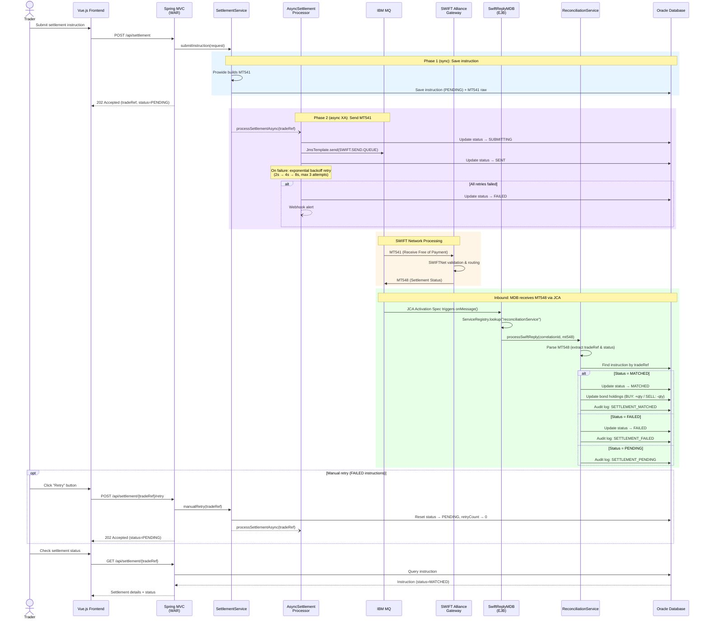
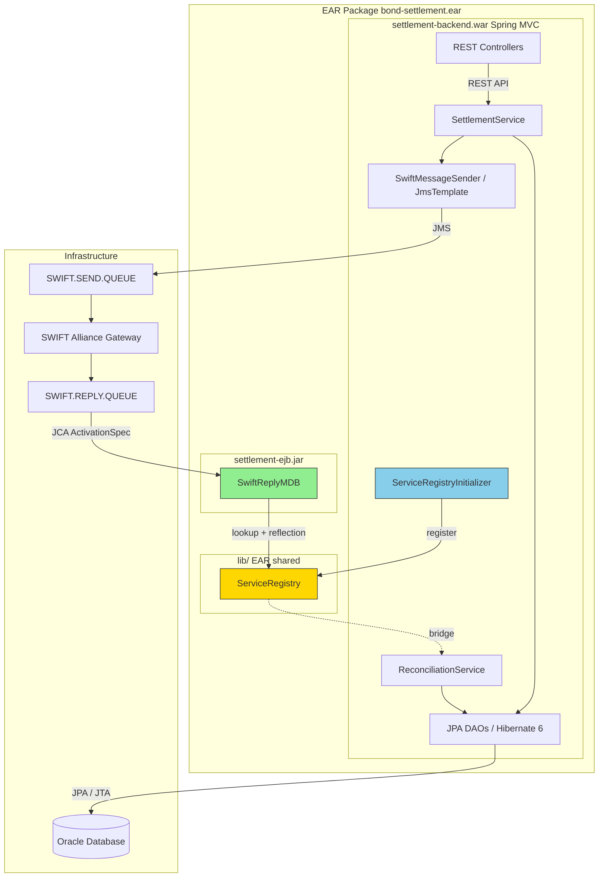
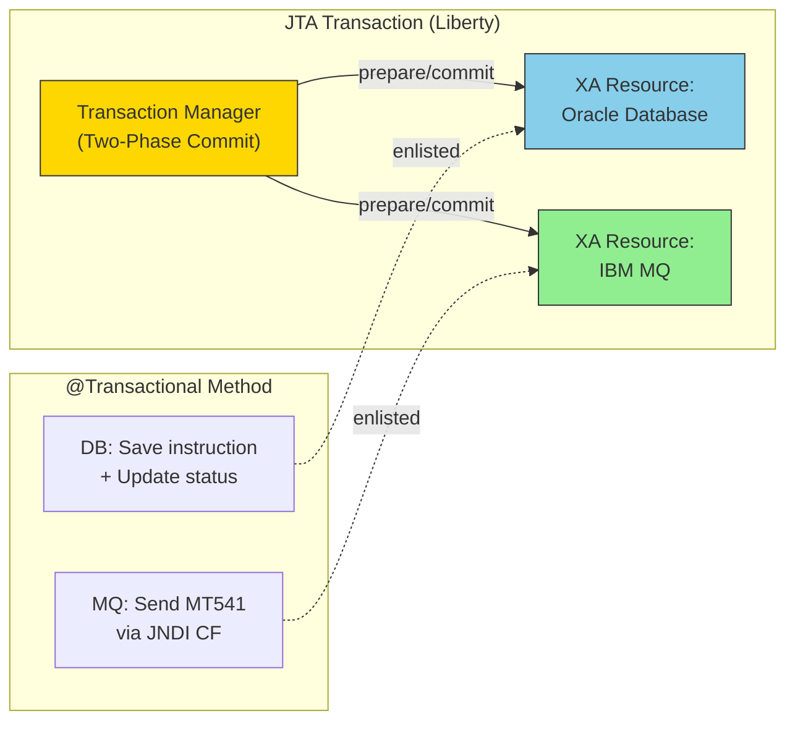

# Bond Settlement System

A complete SWIFT bond settlement system built for IBM WebSphere + Oracle environment.

## Architecture

- **Frontend**: Vue.js 3 + Vite + Axios
- **Backend**: Spring MVC 6 REST API
- **SWIFT Messaging**: Prowide Core (MT541 send / MT548 receive)
- **Message Queue**: IBM MQ via JMS
  - **Sending**: Spring JmsTemplate with application-managed MQ client connection
  - **Receiving**: Message-Driven EJB (MDB) via JCA activation spec on IBM MQ Resource Adapter
- **Persistence**: Hibernate 6 / JPA 3.1 on Oracle Database
- **Application Server**: IBM WebSphere Liberty (Jakarta EE 10)
- **Packaging**: EAR (WAR + EJB JAR + Common Library)

## Prerequisites

- JDK 21
- Maven 3.9+
- Node.js 20+ (for frontend)
- Docker & Docker Compose (for local development)

### Runtime Stack (provided via Docker)

- IBM WebSphere Liberty 24.x (Jakarta EE 10)
- IBM MQ 9.3+ (Jakarta-compatible Resource Adapter)
- Oracle Database 19c+ (XE edition for dev)

## Settlement Flow


### Component Architecture



## Quick Start (Docker)

### 1. Prepare dependencies

Download the following and place in `docker/liberty/`:

```bash
# Oracle JDBC driver (from Maven Central or Oracle)
mkdir -p docker/liberty/jdbc
cp ~/.m2/repository/com/oracle/database/jdbc/ojdbc11/23.3.0.23.09/ojdbc11-23.3.0.23.09.jar \
   docker/liberty/jdbc/ojdbc11.jar
```

### 2. Build

```bash
mvn clean package -DskipTests
```

### 3. Start Docker environment

```bash
docker compose up -d
```

This starts:
- **Oracle XE** on port `1521`
- **IBM MQ** on port `1414` (web console on `9443`)
- **WebSphere Liberty** on port `9080` (HTTPS on `9444`)

The Liberty image is built from `docker/liberty/Dockerfile`, which extracts the IBM MQ Jakarta Resource Adapter (`wmq.jakarta.jmsra.rar`) from the MQ container image via multi-stage build.

### 4. Initialize database

Wait for Oracle to be healthy, then run the DDL:

```bash
docker exec -i settlement-oracle bash -c \
  "sqlplus settlement/settlement123@//localhost:1521/XEPDB1" < db/V1__create_schema.sql
```

### 5. Verify deployment

```bash
# Check MQ connectivity
curl http://localhost:9080/settlement/api/mq/health

# Test MDB message delivery (sends test MT548 to reply queue)
curl -X POST "http://localhost:9080/settlement/api/mq/test-mdb?correlationId=TEST-001"

# Check application health
curl http://localhost:9080/settlement/api/holdings

# Submit a settlement instruction
curl -X POST http://localhost:9080/settlement/api/settlement \
  -H "Content-Type: application/json" \
  -d '{
    "isin": "US0378331005",
    "quantity": 1000,
    "direction": "BUY",
    "counterparty": "DEUTDEFF",
    "bicCode": "CITIUS33",
    "accountId": "ACC-001",
    "settlementDate": "2026-06-01"
  }'
```

### 6. Build frontend (optional)

```bash
cd settlement-frontend
npm install
npm run dev    # Development server on http://localhost:5173
npm run build  # Production build
```

## Common Commands

| Command | Description |
|---------|-------------|
| `mvn clean package` | Build all modules (produces EAR) |
| `mvn clean package -DskipTests` | Build without running tests |
| `mvn test` | Run unit tests |
| `mvn verify` | Run unit + integration tests |
| `docker compose up -d` | Start all services |
| `docker compose down` | Stop all services |
| `docker compose up -d --force-recreate liberty` | Redeploy after rebuild |
| `docker compose logs -f liberty` | Follow Liberty logs |
| `docker compose logs -f ibmmq` | Follow MQ logs |

## MQ Administration

```bash
# Enter MQ container
docker exec -it settlement-mq bash

# Check queue depths
echo "DISPLAY QLOCAL(*) CURDEPTH" | runmqsc SETTLEMENT_QM

# Put a test message on reply queue
echo "test message body" | /opt/mqm/samp/bin/amqsput SWIFT.REPLY.QUEUE SETTLEMENT_QM

# Browse messages (non-destructive)
/opt/mqm/samp/bin/amqsbcg SWIFT.SEND.QUEUE SETTLEMENT_QM
```

## Database Administration

```bash
# Connect to Oracle
docker exec -it settlement-oracle sqlplus settlement/settlement123@//localhost:1521/XEPDB1

# Useful queries
SELECT TRADE_REF, STATUS, ISIN FROM SETTLEMENT_INSTRUCTION ORDER BY CREATED_AT DESC;
SELECT * FROM BOND_HOLDING;
SELECT TRADE_REF, EVENT_TYPE, DETAIL FROM AUDIT_LOG ORDER BY CREATED_AT DESC;
```

## Modules

| Module | Description |
|--------|-------------|
| `settlement-common` | Shared library with cross-module service bridge (ServiceRegistry) |
| `settlement-backend` | Spring MVC WAR with REST API, service layer, JMS sender |
| `settlement-ejb` | Message-Driven EJB for SWIFT MT548 reply processing |
| `settlement-ear` | Enterprise Archive packaging for WebSphere deployment |
| `settlement-frontend` | Vue.js 3 single-page application |

## Project Structure

```
my-bond-settlement-system/
├── pom.xml                          # Parent POM (dependency management)
├── docker-compose.yml               # Local dev environment
├── db/
│   └── V1__create_schema.sql        # Oracle DDL
├── docker/
│   ├── liberty/
│   │   ├── server.xml               # Liberty config (MQ RA, JMS, activation spec)
│   │   ├── Dockerfile               # Liberty image with MQ Jakarta RA
│   │   └── jdbc/                    # JDBC driver (gitignored)
│   └── mq/
│       └── config.mqsc              # MQ queue definitions
├── settlement-common/               # Shared library (ServiceRegistry)
├── settlement-backend/              # Spring MVC WAR module
│   └── src/main/java/com/settlement/
│       ├── config/
│       │   ├── MqClientConfig.java          # JNDI JMS ConnectionFactory + JmsTemplate (XA)
│       │   └── ServiceRegistryInitializer.java  # Registers Spring beans for MDB access
│       ├── controller/
│       │   ├── SettlementController.java    # REST API
│       │   └── MqConnectivityController.java # MQ health & MDB test endpoints
│       ├── service/                         # Business logic
│       ├── jms/SwiftMessageSender.java      # JMS sender (MT541)
│       ├── reconcile/ReconciliationService.java # MT548 processing & reconciliation
│       ├── dao/                             # Data access (JPA)
│       ├── entity/                          # JPA entities
│       └── dto/                             # Request/Response DTOs
├── settlement-ejb/                  # EJB module
│   └── src/main/
│       ├── java/com/settlement/ejb/
│       │   └── SwiftReplyMDB.java           # Message-Driven Bean (MT548 receiver)
│       └── resources/META-INF/
│           ├── ejb-jar.xml                  # EJB deployment descriptor
│           └── ibm-ejb-jar-bnd.xml          # Liberty MDB activation spec binding
├── settlement-ear/                  # EAR packaging
├── settlement-frontend/             # Vue.js 3 frontend
└── docs/
    └── openapi.yaml                 # API specification
```

## Messaging Architecture

### Outbound (Send MT541)

```
Spring JmsTemplate → MQQueueConnectionFactory (app-managed) → SWIFT.SEND.QUEUE → SWIFT Gateway
```

### Inbound (Receive MT548)

```
SWIFT Gateway → SWIFT.REPLY.QUEUE → JCA Activation Spec (container-managed)
    → SwiftReplyMDB.onMessage()
    → ServiceRegistry.lookup("reconciliationService")
    → ReconciliationService.processSwiftReply()
    → Oracle DB (update status + holdings)
```

### Cross-Module Bridge

The WAR (Spring) and EJB modules run in separate classloaders within the EAR.
`ServiceRegistry` in `settlement-common` (EAR lib/) provides a thread-safe bridge:
- **WAR startup**: `ServiceRegistryInitializer` registers Spring-managed `ReconciliationService`
- **MDB runtime**: `SwiftReplyMDB` retrieves it via `ServiceRegistry.lookup()` + reflection

### Transaction Management (JTA + XA Two-Phase Commit)

The system uses **JTA with XA two-phase commit** to guarantee atomic consistency between Oracle Database and IBM MQ. Liberty's JTA transaction manager coordinates both resources.



**Why JTA is required:**

1. **XA consistency (outbound)** — `AsyncSettlementProcessor.executeSettlement()` updates Oracle AND sends MT541 to MQ in the same `@Transactional` method. Using a container-managed JNDI `ConnectionFactory` (`jms/SwiftQueueCF`), both resources are enlisted in the JTA transaction. If either fails, both roll back atomically.
2. **MDB compatibility (inbound)** — MDB runs in a container-managed JTA transaction. Spring's `@Transactional` on `ReconciliationService.processSwiftReply()` joins this existing JTA transaction instead of attempting a local `Connection.commit()` (which would cause `DSRA9350E`).
3. **Hibernate JTA platform** — configured via `hibernate.transaction.jta.platform` = `WebSphereLibertyJtaPlatform`.

**XA Transaction Timeout:**

Configured in `server.xml` with explicit values:

| Setting | Value | Description |
|---------|-------|-------------|
| `totalTranLifetimeTimeout` | 30s | Max lifetime for XA global transaction |
| `propogatedOrBMTTranLifetimeTimeout` | 30s | Max lifetime for propagated / BMT transactions |
| `clientInactivityTimeout` | 10s | Max idle time before transaction times out |
| `LPSHeuristicCompletion` | ROLLBACK | Heuristic decision on failure: rollback for safety |

Key configuration:

| File | Setting | Purpose |
|------|---------|---------|
| `applicationContext.xml` | `JtaTransactionManager` | Spring delegates to Liberty's JTA |
| `applicationContext.xml` | `jtaDataSource` (not `dataSource`) | DB connection enlisted in JTA |
| `MqClientConfig.java` | `InitialContext.doLookup("jms/SwiftQueueCF")` | MQ connection enlisted in JTA |
| `server.xml` | `<jmsQueueConnectionFactory>` | Container-managed XA connection factory |
| `server.xml` | `<transaction>` | XA timeout & heuristic config |

### Async Processing & Retry

Settlement submission follows a **two-phase async pattern** to minimize client latency:

**Phase 1 (sync, fast):** HTTP request saves the instruction with `PENDING` status to Oracle (no MQ involved), returns `202 Accepted` immediately.

**Phase 2 (async, XA):** A container-managed thread runs `AsyncSettlementProcessor.executeSettlement()` which performs the XA transaction (DB update + JMS send). Uses Liberty's `DefaultManagedExecutorService` so the thread can participate in JTA transactions.

**Retry on failure:**

| Aspect | Detail |
|--------|--------|
| Strategy | Exponential backoff: 2s → 4s → 8s (max 30s) |
| Max attempts | 3 |
| Retry trigger | Inline in the async thread (no DB polling needed) |
| Final state | `FAILED` with `failureReason` and `retryCount` recorded |
| Webhook alert | Sent when all retries exhausted (configurable URL) |
| Manual retry | Traders can retry via `POST /api/settlement/{tradeRef}/retry` |
| Crash recovery | Scheduler scans for orphaned `SUBMITTING`/`PENDING` every 120s |

**Status flow:**

```
PENDING → SUBMITTING → SENT → MATCHED     (happy path)
PENDING → SUBMITTING → FAILED              (all 3 retries failed)
FAILED  → PENDING → SUBMITTING → SENT      (manual retry success)
```

## API Endpoints

| Method | Path | Description |
|--------|------|-------------|
| `GET` | `/api/holdings` | List all bond holdings |
| `GET` | `/api/holdings/{accountId}` | Get holdings for account |
| `POST` | `/api/settlement` | Submit settlement instruction (returns 202, async processing) |
| `GET` | `/api/settlement/{tradeRef}` | Get instruction status (includes `retryCount`, `failureReason`) |
| `POST` | `/api/settlement/{tradeRef}/retry` | Manual retry for FAILED instructions |
| `GET` | `/api/mq/health` | IBM MQ connection health check |
| `POST` | `/api/mq/test-mdb` | Send test MT548 to verify MDB processing |

## Configuration

Environment variables used by the Docker setup:

| Variable | Default | Description |
|----------|---------|-------------|
| `ORACLE_HOST` | `oracle` | Oracle DB hostname |
| `ORACLE_PORT` | `1521` | Oracle DB port |
| `MQ_HOST` | `ibmmq` | IBM MQ hostname |
| `MQ_PORT` | `1414` | IBM MQ port |
| `MQ_CHANNEL` | `SETTLEMENT.SVRCONN` | MQ channel name |
| `MQ_QMGR` | `SETTLEMENT_QM` | MQ queue manager |
| `MQ_USER` | `app` | MQ application user |
| `MQ_PASSWORD` | `passw0rd` | MQ application password |

Application properties (`settlement.properties`):

| Property | Default | Description |
|----------|---------|-------------|
| `settlement.alert.webhook.enabled` | `false` | Enable webhook alerts for retry exhaustion |
| `settlement.alert.webhook.url` | (empty) | Webhook URL (Slack, PagerDuty, DingTalk, etc.) |

## Liberty Server Configuration

Key server.xml elements for MDB activation:

| Element | Purpose |
|---------|---------|
| `<resourceAdapter id="mqJmsRa">` | IBM MQ Jakarta Resource Adapter |
| `<jmsQueueConnectionFactory>` | Container-managed MQ connection factory |
| `<jmsQueue>` | SWIFT send/reply queue definitions |
| `<jmsActivationSpec id="jms/SwiftReplyActivationSpec">` | MDB activation spec bound to SWIFT.REPLY.QUEUE |

## Troubleshooting

### Liberty startup slow

Liberty first start downloads features. Subsequent starts are faster (~25s).

### MQ connection refused (MQRC 2035)

Ensure MQ permissions are granted:

```bash
docker exec settlement-mq bash -c '
  setmqaut -m SETTLEMENT_QM -t qmgr -p app +connect +inq
  setmqaut -m SETTLEMENT_QM -t queue -n "SWIFT.*" -p app +put +get +inq
  echo "REFRESH SECURITY(*)" | runmqsc SETTLEMENT_QM
'
```

### MDB not receiving messages

1. Check activation spec binding: `docker logs settlement-liberty | grep CNTR0180I`
2. Check endpoint activation: `docker logs settlement-liberty | grep J2CA8801I`
3. Verify MQ RA installed: `docker logs settlement-liberty | grep J2CA7001I`
4. Test connectivity: `curl http://localhost:9080/settlement/api/mq/health`

### MDB receives messages but DB not updated

Check for `DSRA9350E: Operation Connection.commit is not allowed during a global transaction` in FFDC logs. This indicates Spring is using `JpaTransactionManager` instead of `JtaTransactionManager`. Ensure `applicationContext.xml` uses `JtaTransactionManager` and `jtaDataSource` (see Transaction Management section above).

## API Documentation

See [docs/openapi.yaml](docs/openapi.yaml) for the full OpenAPI 3.0 specification.
